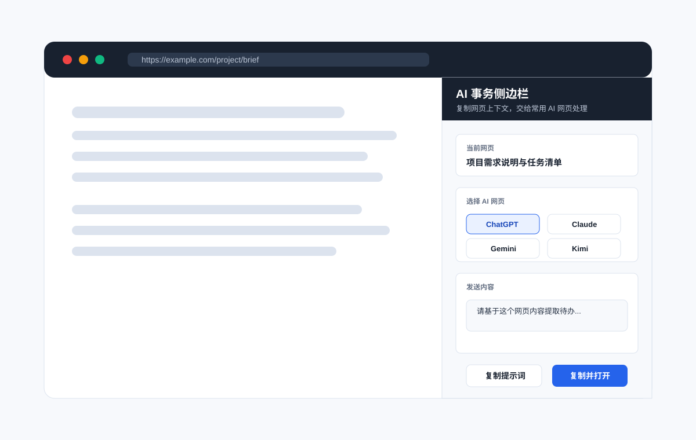
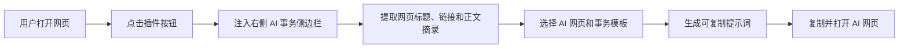

# AI Sidebar Hub

AI Sidebar Hub 是一个独立的 Chrome / Edge 浏览器插件。它可以在任意普通网页右侧打开一个 AI 事务侧边栏，自动提取当前网页标题、链接和正文摘录，整理成可直接发送给 AI 的提示词，并一键打开常用 AI 网页继续处理任务。



## 解决的问题

当用户在网页中阅读项目需求、文章、文档、邮件或产品说明时，经常需要把页面内容复制到不同 AI 工具中做总结、拆任务、写回复或做决策分析。手动复制网页内容、整理上下文、切换 AI 网站会浪费很多时间。

AI Sidebar Hub 把这个流程压缩成一个侧边栏：

- 自动读取当前网页上下文
- 按事务场景生成提示词
- 一键复制并打开指定 AI 网页
- 在不绑定 API Key 的情况下使用用户已有的 AI 网页账号

## 核心功能

| 功能 | 说明 |
| --- | --- |
| 网页侧边栏 | 在当前网页右侧注入固定侧边栏，不离开原网页即可整理任务 |
| 网页上下文提取 | 自动提取标题、URL、正文摘录，并过滤导航、脚本、页脚等噪音 |
| 多 AI 网页入口 | 支持 ChatGPT、Claude、Gemini、DeepSeek、Kimi、豆包、Perplexity、Copilot |
| 事务模板 | 内置总结网页、整理待办、写邮件、分析决策四类模板 |
| 一键复制 | 将网页上下文和任务指令合成提示词，一键复制到剪贴板 |
| 复制并打开 | 复制提示词后自动打开选中的 AI 网页 |

## 为什么采用“复制并打开”而不是 iframe 嵌入

很多 AI 官网会通过 `X-Frame-Options` 或 `Content-Security-Policy: frame-ancestors` 禁止第三方网页用 iframe 嵌入，例如 ChatGPT、Claude、Gemini 等服务通常不允许被插件侧边栏直接框进来。

因此本项目采用更稳定、真实可用的流程：

1. 在当前网页侧边栏提取上下文。
2. 用户选择 AI 网页和事务模板。
3. 插件生成完整提示词。
4. 一键复制提示词并打开 AI 网页。
5. 用户粘贴到对应 AI 网站继续处理。

这样不需要服务器、不需要模型 API Key，也不会绕过 AI 网站自身的安全策略。

## 快速开始

1. 下载或克隆本项目。
2. 打开 Chrome 或 Edge 扩展管理页。
   - Chrome: `chrome://extensions/`
   - Edge: `edge://extensions/`
3. 开启“开发者模式”。
4. 点击“加载已解压的扩展程序”。
5. 选择项目目录 `AI-Sidebar-Hub`。
6. 打开任意普通网页。
7. 点击插件图标，然后点击“打开侧边栏”。

## 使用方式

1. 打开需要处理的网页。
2. 点击浏览器工具栏中的 AI Sidebar Hub 图标。
3. 打开侧边栏。
4. 选择 AI 服务，例如 ChatGPT、Claude、DeepSeek 或 Kimi。
5. 选择事务模板，例如“整理待办”。
6. 点击“复制并打开”。
7. 在新打开的 AI 网页中粘贴提示词并运行。

## 项目结构

```text
.
├── README.md
├── manifest.json
├── popup.html
├── popup.css
├── popup.js
├── content.js
├── sidebar.css
├── LICENSE
└── assets
    └── showcase.svg
```

## 工作流程



## 技术实现

- `manifest.json` 使用 Chrome Manifest V3。
- `popup.js` 负责从扩展弹窗向当前标签页发送消息。
- `content.js` 负责注入侧边栏、提取页面正文、生成提示词。
- `sidebar.css` 负责隔离式侧边栏样式。
- `assets/showcase.svg` 用于 GitHub README 效果展示。

## 后续计划

- 支持自定义 AI 站点
- 支持自定义事务模板
- 支持处理用户选中文本
- 支持历史提示词记录
- 支持快捷键打开侧边栏
- 支持真实 AI API 模式，与网页版模式并存

## 许可

MIT License
